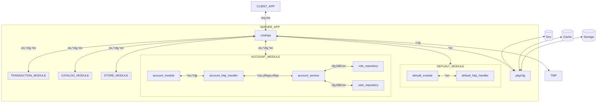

# Point of Sales BackEnd System



### Create Mocks

#### Required tools:
- [Mockery](https://github.com/vektra/mockery)

#### How to use
```bash
mockery 
  --dir=internal/account/repository/mysql 
  --name=RoleSqlRepository 
  --filename=role_sql_repository.go 
  --output=domain/mocks --outpkg=mocks 
```

more info read the [docs](https://pkg.go.dev/github.com/stretchr/testify/mock).

### Database Migration

#### Required tools:
- [Golang Migrate](https://github.com/golang-migrate/migrate)

#### How to use

- Add new migration
    ```bash
    migrate create -ext sql -dir db/migrations example_table
    ```
- Run Migration

    `POSTGRESQL_URL: 'postgresql://postgres:@localhost:5432/posbe?sslmode=disable'`

  - set version (dirty state) (version: -1 before last migrate)
    ```bash
     migrate -database ${POSTGRESQL_URL} -path db/migrations force ${VERSION} 
    ```
  - up
    ```bash
    migrate -database ${POSTGRESQL_URL} -path db/migrations up
    ```
  - down
    ```bash
    migrate -database ${POSTGRESQL_URL} -path db/migrations down
    ```
    
more info read the [docs](https://pkg.go.dev/github.com/golang-migrate/migrate/v4).
