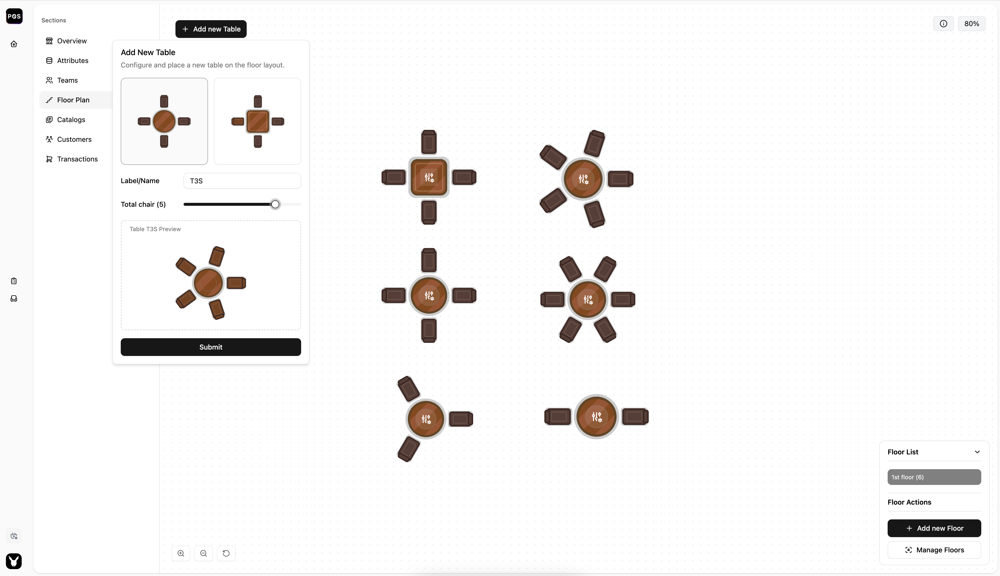
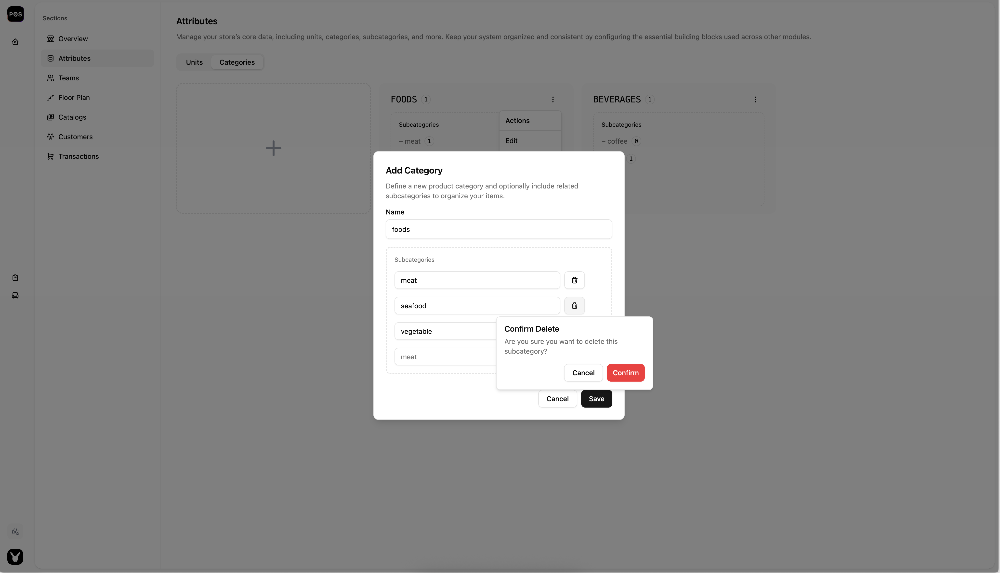

# POSBE – Simple Point of Sale for Restaurants, Bars, and Coffee Shops

##### Features

1. **Product Management**  
   Easily create, update, and organize products with categories, variant pricing, and availability controls.

2. **User & Customer Management**  
   Manage staff roles, permissions, and customer profiles to streamline operations and build customer loyalty.

3. **Floor Plan Designer**  
   Interactive drag-and-drop table and seating layout builder for managing dine-in orders efficiently.

4. **Dine-In or Takeaway Ordering**  
   Flexible order flow with quick access for takeaway or full dine-in service, designed to speed up checkout.

5. **Shift Management**  
   Track staff shifts, manage schedules, and monitor work hours for smoother operations.

6. **Simple UI & Easy Navigation**  
   Clean, intuitive interface with streamlined navigation that reduces the learning curve and gives quick access to core features for faster daily operations.

##### Preview 

  
  

