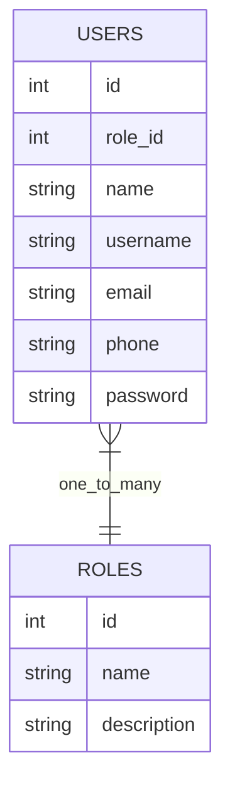

# ENTITY DIAGRAM AND DEFAULT DATA

### Current Default Roles Data
1. admin - all access (web admin & desktop client)
2. cashier - order and payment (desktop client)
3. waiter - reservation and order (desktop client)