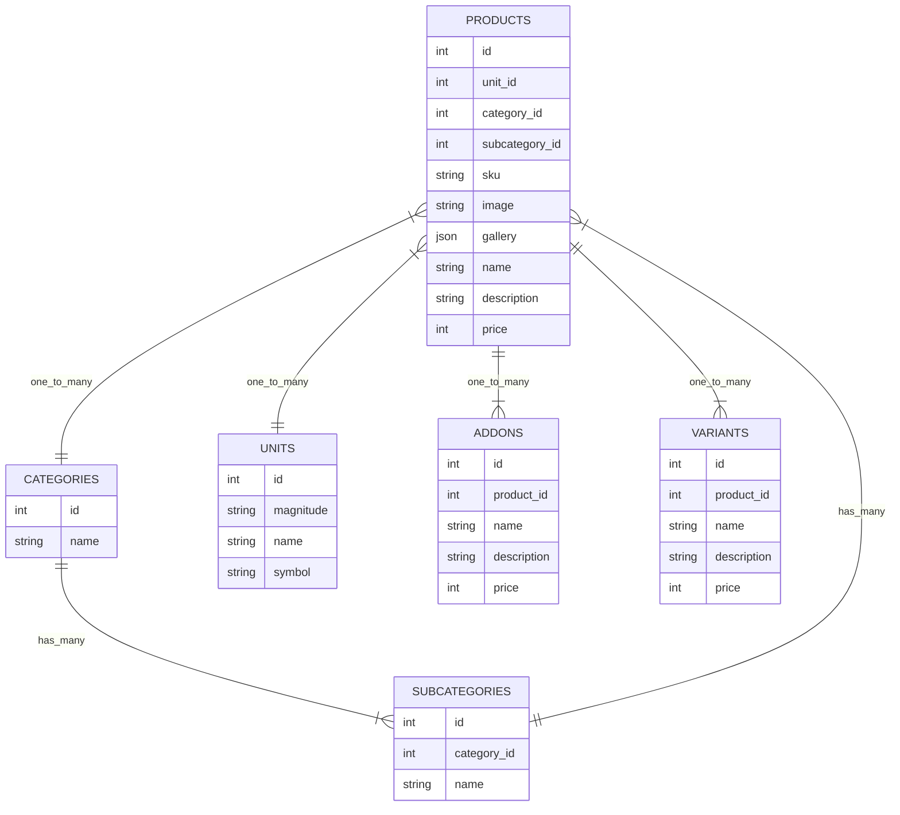

# ENTITY DIAGRAM AND DEFAULT DATA

#### ADDONS:
e.g:
1. EXTRA MILK
2. EXTRA SUGAR
3. EXTRA ...

#### VARIANTS: 
e.g:
1. Tall
2. Grande
3. Venti

#### CATEGORY
1. Beverage
2. Foods

#### SUBCATEGORY:
1. Beverage:
   1. Water
   2. Milk
   3. Tea
   4. Coffee
   5. Sparkling drinks
   6. Juices
   7. Energy drink
   8. Mocktails
   9. Cocktails
   10. Milkshakes
   11. Smoothies
   12. Tonic Water
   13. Beer
   14. Wine
   15. Cider

2. Foods:
   1. Fat
   2. Protein
   3. Dairy
   4. Starchy food
   5. Fruit and vegetables
