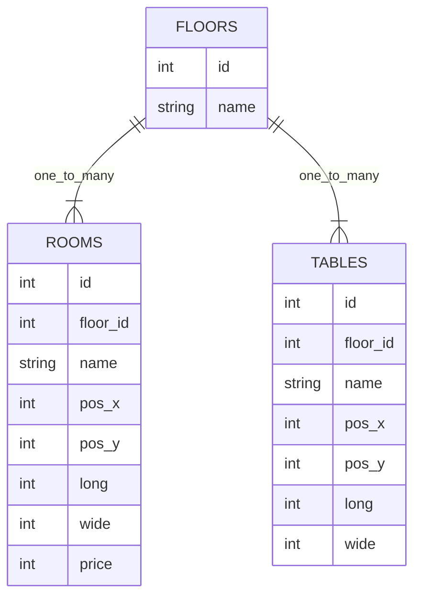

# ENTITY DIAGRAM AND DEFAULT DATA

```mermaid
erDiagram
    FLOORS {
        int id
        string name
    }
    
    ROOMS {
        int id
        int floor_id
        string name
        int pos_x
        int pos_y
        int long
        int wide
        int price
    }
    
    TABLES {
        int id
        int floor_id
        string name
        int pos_x
        int pos_y
        int long
        int wide
    }  
    
    FLOORS ||--|{ ROOMS : one_to_many
    FLOORS ||--|{ TABLES : one_to_many
```